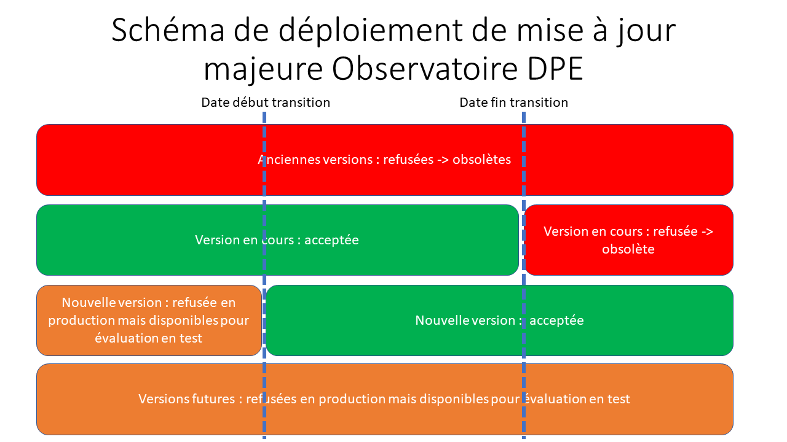

# Introduction

Ce dépôt de code source héberge les modèles de données du nouveau DPE entré en vigueur au 1er juillet 2021 et de l'audit réglementaire logement en cours de préparation. 
Ces deux modèles sont hébergés sur ce même dépôt car il existe des liens très forts de description de ces deux modèles. Notamment, ces deux modèles sont tous les deux une application de la méthode de calcul du nouveau DPE.

Ces modèles de données sont au format xml et spécifié par des XSD. L'ensemble des XSD et des ressources associées sont présents dans [modele_donnee](https://gitlab.com/observatoire-dpe/observatoire-dpe/-/tree/master/modele_donnee)

En plus des modèles de données est hebergé sur ce dépot de source un moteur de contrôle de cohérence (webservice + code de calcul) qui permet de contrôler différents aspects complémentaires à la validation XML/XSD.
Ce moteur de contrôle a une déclinaison pour l'audit et pour le DPE. (sous dépôt svc_controle_coherence)

Ce code est déployé sur l'observatoire DPE de l'ADEME et permet de s'assurer de la bonne qualité des données transmises aux deux bases de données DPE et AUDIT qui stockent tous les DPE et audit réglementaires logements réalisés en France métropolitaine.

# procédures de mise à jour

Deux types de procédures de mise à jour sont executées sur le modèle de données de l'observatoire DPE. Une pour les mises à jour
mineures et une seconde pour les mises à jour majeures. 

## description mise à jour mineures

Les mises à jour mineures concernent des correctifs/mises à jour liées au modèle de données ou du contrôle de cohérence. 
Elles peuvent aussi intégrer des corrections de tables de valeurs mineures de la méthode de calcul. 
Ces mises à jour sont rétroactives et ne sont pas de nature **bloquante**. Ainsi une modification mineure déployée ne doit pas empêcher 
les dépôts de DPE qui ne prennent pas encore en compte cette modification. 

la mise à jour 

les changements de mises à jour sont tracées par des changelog sur les deux volets : 

* [modele de donnée](https://gitlab.com/observatoire-dpe/observatoire-dpe/-/blob/master/modele_donnee/CHANGELOG.md)

* [controle de cohérence](https://gitlab.com/observatoire-dpe/observatoire-dpe/-/blob/master/svc_controle_coherence/CHANGELOG.md)

## description mise à jour majeures

Les mises à jour majeures concernent des évolutions de méthodes important et/ou la mise à jour d'annexes des arrêtés sur les prix de l'énergie , contenu CO2 des energies
ou contenu CO2/taux d'ENR des réseau de chaleur. les changements de type mises à jour majeures donnent lieu à une bascule de enum_version_id en plus des changements tracé dans les changelogs.
Le passage à une nouvelle version est une modification **bloquante** en plus d'éventuelles autres mises à jour de ce type. Pour pouvoir
passer à cette nouvelle version une mise à jour des logiciels DPE prenant en compte cette modification est obligatoire.
Une période de transition est prévue à chaque modification majeure. Pendant cette transition coexistent la version précédente et
la nouvelle version déployée avec la modification majeure. 

## procédure de mise à jour pour les mises à jour mineures(étape par étape)

* la mises à jour est publiée sur le [master](https://gitlab.com/observatoire-dpe/observatoire-dpe/-/tree/master/) de ce dépot (CSTB)

* un tag de release correspondant est publié précisant le numéro de version du modèle de données (XSD) et le numéro de version du contrôle de cohérence. Exemple:`mdd-vX.X.X-svc-vX.X.X-{suffix_text}`  (CSTB)

* l'information de release de la nouvelle version est transmise aux éditeurs de logiciels par canal mail et forum.  (DHUP/CSTB)

* le service de contrôle de cohérence est déployé avec le nouveau modèle de donnée immédiatement sur une url de test hebergée par le CSTB (temporaire) (CSTB)

* le service de contrôle de cohérence est déployé avec le nouveau modèle de donnée sur l'url de préproduction de l'observatoire DPE ADEME (ADEME)

* le service de contrôle de cohérence est déployé avec le nouveau modèle de donnée en production sur l'observatoire de l'ADEME et est officiellement appliqué à tous les DPE déposés. (ADEME)

* les éditeurs de logiciels implémentent les correctifs de la mise à jour mineure à partir de la publication en production. (Editeurs de Logiciels)

## procédure de mise à jour pour les mises à jour majeures (étape par étape)

* un interval de date transitoire est défini pour effectuer la bascule entre les deux version (actuelle et en cours de déploiement). ces dates de validité sont mises à jour sur les versions concernées dans le moteur controle de cohérence (DHUP/CSTB)

* la mises à jour est publiée sur le [master](https://gitlab.com/observatoire-dpe/observatoire-dpe/-/tree/master/) de ce dépot (CSTB)

* un tag de release correspondant est publié précisant le numéro de version du modèle de données (XSD) et le numéro de version du contrôle de cohérence. Exemple:`mdd-vX.X.X-svc-vX.X.X-{suffix_text}`

* l'information de release de la nouvelle version est transmise aux éditeurs de logiciels par canal mail et forum. (DHUP/CSTB)

* le service de contrôle de cohérence est déployé avec le nouveau modèle de donnée immédiatement sur une url de test hebergée par le CSTB (temporaire) (CSTB)

* le service de contrôle de cohérence est déployé avec le nouveau modèle de donnée sur l'url de préproduction de l'observatoire DPE ADEME (ADEME)

* le service de contrôle de cohérence est déployé avec le nouveau modèle de donnée en production sur l'observatoire de l'ADEME et est officiellement appliqué à tous les DPE déposés. (ADEME)

* à la date d'échéance prévue la version antérieure devient obsolète et donc rejetée. 

* OPTION : si une extension de période de transition est décidée alors le moteur de contrôle de cohérence est remis à jour pour prendre en compte l'extension. (CSTB)

* OPTION : l'extension est mise à jour en production rapidement (ADEME)

* les éditeurs de logiciels implémentent les correctifs de la mise à jour majeur à partir de la publication en production ADEME et du démarrage de la période transitoire décidée (Editeurs de Logiciels)

# modèle de donnée de l'audit energétique réglementaire

# codification des tags (à partir du 2022-04-21)

dpe-mdd-vx.x.x-controle-y.y.y : tag officiel d'une nouvelle version contrôle cohérence DPE + XSD DPE à mettre en production

audit-mdd-vx.x.x-controle-y.y.y : tag officiel d'une nouvelle version contrôle cohérence AUDIT + XSD AUDIT à mettre en production

dpe-prod-ademe-fix-mdd-vx.x.x-controle-y.y.y : tag officiel de FIX d'une version en production de contrôle cohérence DPE + XSD DPE

audit-prod-ademe-fix-mdd-vx.x.x-controle-y.y.y : tag officiel de FIX d'une version en production de contrôle cohérence DPE + XSD DPE

# note sur les numéros de versions

la mise en version du XSD et du moteur de contrôle de cohérence du DPE et de l'AUDIT se fait comme suit : 

* X.Y.Z

changement de version majeure X : pour des changements importants sont apportés modifiant la base de données avec des ajouts ou suppression de champs.

changement de version mineur Y : pour tout autre changement nécessitant une intégration par les éditeurs de logiciels. 

changement de version Z : utilisé uniquement pour corriger la production de l'ADEME en cours sur des bugs bloquants ou des changements de dates. (ne nécessite pas de modification/intégration de la part des éditeurs de logiciels) 

Ex. 1.11.1 est une version du contrôle de cohérence déployé en production pour corriger la 1.11.0 
