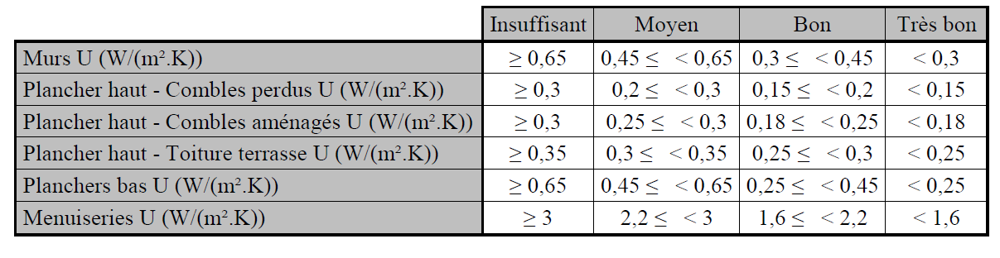
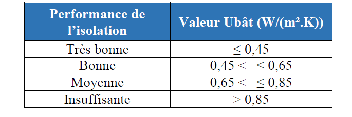

# Introduction

Ce document est à destination des utilisateurs de la base de données DPE de l'ADEME mise en service en juillet 2021 pour collecter les DPE issus de la nouvelle réforme du DPE entrée en vigueur au 1er juillet 2021.

Le document est structuré en deux parties. Une première partie appelée **informations essentielles pour l'interprétation des données de l'observatoire** a pour but de présenter les éléments essentiels à connaitre sur la base de données et de faciliter la compréhension et l'exploitation des jeux de données simplifiés mis à disposition par l'ADEME. Une seconde partie **Informations avancées pour l'exploitation de la base de données complète** s'adresse à un public plus averti qui souhaiterait exploiter la base de données relationnelle dans son intégralité. 

**NB :** Ce document ne traite **pas** de l'ancienne base DPE ADEME en vigueur de 2012 à septembre 2021 qui contient plus de 10 Millions de DPE. Ce document ne concerne que les DPE post réforme du 1er juillet 2021.  

# informations essentielles pour l'interprétation des données de l'observatoire

## jeux de données simplifiés mis à disposition par l'ADEME

La base de données des DPE est une base de données relationnelle dont l'exploitation peut être difficile pour un public non averti.  L'ADEME propose 6 jeux de données synthétique avec à chaque fois une ligne par DPE contenant des informations synthétiques issues de ces DPE. 

* Le jeu de données « DPE Logement existant – exhaustif »
* Le jeu de données « DPE  Logement existant – synthèse »
* Le jeu de données « DPE Logement neuf – exhaustif »
* Le jeu de données « DPE Logement neuf – synthèse »
* Le jeu de données « DPE Tertiaire – exhaustif »
* Le jeu de données « DPE Tertiaire – synthèse »

La différence entre les jeux de données exhaustifs et de synthèse est le nombre de champ exposés.  Le jeu de synthèse ayant un filtre pour ne montrer que les champs les plus pertinents. 

Comme il sera vu dans les sections suivantes le DPE logement existant est bien plus riche en termes de données disponibles que les deux autres type de DPE (logement neuf et tertiaire) qui font l'objet aujourd'hui d'une saisie de donnée à minima. 

**NB :** Dans cette section lorsque des champs de la base de données sont évoqués ils seront systématiquement dénommé par leur nom de champ de la base de données suivi du nom dans les jeux de donnés simplifiés. Exemple enum_version_id(Version DPE). enum_version_id est le nom retrouvé en base de donnée, "Version DPE" est le nom que l'on retrouve dans le jeu de données simplifié de l'ADEME. 

## Ressources à connaitre pour l'exploitation de la base de données

La base de données DPE de l'ADEME est basé sur un modèle de données dont l'ensemble du code source et des ressources associées sont disponibles dans ce dépôt de code open source : 

https://gitlab.com/observatoire-dpe/observatoire-dpe

pour les personnes qui ne sont pas familières des langages xml ou python : des représentation sous format excel des différents composants de ce modèle de données sont aussi disponible ici :

[description excel du modèle de données](https://gitlab.com/observatoire-dpe/observatoire-dpe/-/raw/master/modele_donnee/modele_donnee.xlsx)

[fichier excel des listes de valeurs possibles pour les champs énumérés](https://gitlab.com/observatoire-dpe/observatoire-dpe/-/raw/master/modele_donnee/enum_tables.xlsx)

[fichier excel des tables de valeurs utilisées dans la méthode de calcul](https://gitlab.com/observatoire-dpe/observatoire-dpe/-/raw/master/modele_donnee/valeur_tables.xlsx) (pour les calculs "par défaut" des performances des composants.)

Le DPE sur les bâtiments existants est calculé à l'aide d'une méthode de calcul publiée par arrêté. Il est fortement recommandé d'en prendre connaissance car une grande majorité de données de la base repose sur cette méthode de calcul. 

[lien vers la dernière version de la méthode de calcul ](https://www.legifrance.gouv.fr/download/pdf?id=7hpbVyq228foxHzNM7WleDImAyXlPNb9zULelSY01V8=)

Un guide est mis à disposition des diagnostiqueurs DPE pour les guider dans la réalisation d'un DPE. Ce document guide peut s'avérer utile à consulter pour toute personne qui souhaite comprendre comment les DPE sont réalisés aujourd'hui 

[Guide Diagnostiqueur](https://www.ecologie.gouv.fr/sites/default/files/V2_Guide%20diagnostiqueurs%20DPE%20logement%202021.pdf)

Des contrôles de cohérences sont réalisés sur les DPE transmis à l'observatoire afin de s'assurer de la qualité des données transmises dans la base de données. La description et l'inventaire des contrôles de cohérences réalisée sur les DPE est présente ici : 

[lien vers l'inventaire des contrôles de cohérences](https://gitlab.com/observatoire-dpe/observatoire-dpe/-/blob/master/svc_controle_coherence/README.md)

##  Principe du processus de validation du dépôt d'un DPE ADEME dans l'observatoire

Pour chaque DPE déposé dans l'observatoire DPE de l'ADEME il est contrôlé les éléments suivants avant d'autoriser le dépôt du DPE afin d'en assurer la bonne qualité :

* Il est vérifié que le diagnostiqueur effectuant la demande de dépôt est bien certifié pour pouvoir déposer le type de DPE correspondant.

* Il est vérifié que le DPE respecte le modèle de données du DPE pour la version dans laquelle il est soumis. 

* Des contrôles de cohérences sont effectués en complément du strict respect du modèle de données afin de vérifier que chaque élément du DPE correspond bien à une logique de saisie de la méthode de calcul et que tous les éléments d'un composant (mur/baie/système de chauffage etc..) sont cohérents .Exemple pour une baie vitrée : il est vérifié que la performance énergétique d'une baie correspond bien aux éléments décrits sur ce vitrage comme l'épaisseur du double vitrage, le caractère à isolation renforcée de ce vitrage, le matériau de menuiserie etc....). Ce type de contrôle est réalisé pour chaque composant et aussi sur certaines relations entre différents composants.

  Les contrôles de cohérences ne sont réalisés que sur le DPE logement existant et uniquement à partir de la version 2.1 du DPE.  

## Les différents modèles de DPE présents dans l'observatoire

Il existe 3 types de DPE bien différents dans l'observatoire ADEME. Chacun de ces types de DPE fait l'objet d'une saisie différenciée et les informations associées sont assez différentes entre ces différents types de DPE. Il conviendra pour un utilisateur de la base de données de bien distinguer systématiquement ces 3 types de DPE. Les différents types de DPE sont identifiés par le champ : **enum_modele_dpe_id**

**1 : DPE 3CL 2020 méthode logement** (DPE logement existant) : ces DPE constituent la très grande majorité des DPE déposés dans l'observatoire. Ils sont établis selon l'une des variantes de la méthode de calcul 3CL (lien ci-dessus) et sont spécifiques à un usage de logement. Ces DPE concernent soit une maison individuelle, un appartement ou un immeuble entier. Ces DPE sont décrits de manière très détaillée dans l'observatoire avec l'ensemble des données et hypothèses fournies pour réaliser le calcul et les résultats du calcul correspondant. On peut ainsi pour ces DPE trouver de nombreuses informations comme le niveau d'isolation des parois,les performances des vitrages et une description détaillée des installations de chauffage/ECS/ventilation/climatisation. 

**2 et 3 : DPE NEUF logement (RT2012/RE2020)** (DPE logement neuf):  Ces DPE concernent des logements neufs construits récemment. Ils diffèrent des DPE 3CL 2020 car le calcul réalisé utilise directement les résultats de l'étude thermique RT2012 ou de l'étude environnementale RE2020 établie à la construction du bâtiment. Les données d'entrées de simulation **ne sont pas demandées** de manière obligatoire pour ces DPE et sont donc non renseignées dans la grande majorité des cas. Ainsi il est  souvent impossible pour ces DPE d'identifier la nature des installations de chauffage ou encore les performances du bâti et des vitrages.  

**4 : DPE 2006 tertiaire et ERP** (DPE tertiaire) :  Ces DPE concernent les bâtiments tertiaires et sont établis selon l'ancienne méthode DPE dite "facture" toujours en vigueur pour ces bâtiments. Ces DPE sont donc limités à une description des factures par énergie et par usage des bâtiments concernés. 

Les jeux de données simplifiés de l'ADEME sont produits de manière séparée pour chacun de ces modèles cf. section précédente sur les jeux de données simplifiés. 

## Les différentes versions du modèle DPE

chaque DPE présent dans la base de données a un numéro de version associé. Ce numéro de version est un élément important d'interprétation du DPE en base de données car il renseigne à la fois le contexte réglementaire dans lequel a été réalisé le DPE et le niveau d'exigence sur les données à transmettre à l'observatoire ADEME.  Ainsi ce numéro de version sera incrémenté à chaque fois qu'une publication d'un arrêté réglementaire a un impact sur le calcul des DPE. Par exemple la publication annuelle de l'arrêté déclarant le contenu CO2 des réseaux de chaleurs ou la correction de la méthode de calcul ayant eu lieu au 1er novembre 2020 ont fait évolué la version du DPE.  Ce numéro de version sera aussi incrémenté si de nouvelles exigences substantielles sont appliquées sur la transmission des DPE à l'observatoire. 

Il existe à date du 2022/04/01 4 versions du modèle de données DPE **enum_version_id** **(Version DPE) :** 

**Version 1 (du 1er juillet 2021 au 1er novembre 2021) :** Cette version est la version initiale du modèle et correspond à la mise en place du dispositif. Pour cette  version seules les sorties de calcul sont exigés de manière obligatoire pour les DPE 3CL 2020 logement en plus des éléments administratifs. Les données de simulations en entrée de calcul restent optionnelles et aucune vérification/contrôle n'est réalisé sur le modèle de données au delà des restrictions de types. Cette version correspond en termes réglementaire à l'application de l'arrêté du 31 mars 2021 qui a été corrigé depuis.  Les logiciels DPE sont pour cette version toujours en cours d'évaluation.

Pour résumer : les DPE en version 1 sont hétérogènes en termes de données saisies, non vérifiés/contrôlés et sur une méthode de calcul non corrigée. Il manque la grande majorité des données d'entrées de simulation. Ces DPE sont à interpréter avec grande précaution.

**Version 1.1 (du 14 octobre2021 au 4 janvier 2022):** Cette version permet de prendre en compte les corrections de l'arrêté du 8 octobre 2021 sur la méthode de calcul.  Ainsi les DPE réalisés en version 1.1 prennent en compte les corrections réalisés sur les coefficients de ventilation et d'infiltration (modification principale apporté à la méthode). La description du modèle de données est identique à la version 1

Pour résumer : les DPE en version 1.1 sont hétérogènes en termes de données saisies, non vérifiés/contrôlés et sur une méthode de calcul corrigée. Il manque la grande majorité des données d'entrées de simulation. Ces DPE sont à interpréter avec grande précaution. 

**Version 2 (du 1er novembre 2021 à avril 2022):**  Cette version impose aux éditeurs de logiciels la saisie **obligatoire** d'un certain nombre de champs en donnée d'entrée de modèle. A partir de cette version il est possible de trouver des informations sur les installations de chauffage/ECS/ventilation/climatisation renseignées de manière systématique ainsi que des informations sur les composants d'enveloppe.  Cette description détaillée des données d'entrée n'est disponible que pour les DPE de type **1 : DPE 3CL 2020 méthode logement** (DPE logement existant). De plus quelques contrôles essentiels sont réalisés dont un pour s'assurer que les étiquettes énergétiques  sont bien calculées conformément à l'arrêté. 

En revanche la version 2 du modèle de donnée n'implémente pas encore la grande majorité des contrôles de cohérences entre données d'un même DPE. Ainsi il est possible qu'il persiste des erreurs et des incohérences entre des éléments de certains composants (par exemple un système de chauffage déclaré avec la mauvaise énergie associée, un vitrage dont les performances ne correspondent pas à ses caractéristiques etc.. ). 

**Version 2.1 (depuis le 4 décembre 2021):**

La version 2.1 est la version objectif qui correspond à la fin de la période transitoire de mise en place de l'observatoire DPE. A partir de cette version l'ensemble des données d'entrées doit être saisie pour les DPE de type **1 : DPE 3CL 2020 méthode logement**. Un ensemble conséquent de contrôles de cohérences sont effectués pour vérifier la cohérence de chaque composant du DPE.  

A partir de cette version on considère que les DPE de type **1 : DPE 3CL 2020 méthode logement**(DPE logement existant) sont de bonne qualité pour être analysés en détail y compris sur leur données d'entrée de simulation.  De plus la mise en place de cette version coïncide avec la fin de l'évaluation des logiciels DPE sur la partie logement.

**Versions futures** :

Le DPE sera amené à évoluer et donc de futures versions sont à prévoir. Ces versions futures seront déployées lorsqu'une modification d'arrêté avec un impact sur le calcul sera publié ou lorsque de nouveaux contrôles de cohérences seront ajoutés pour fiabiliser le modèle de données du DPE.  

**En résumé :** si vous souhaitez exploiter des données fiabilisées sur l'observatoire DPE pour les logements existants : utilisez les DPE en version **2.1** ou supérieur.  

**NB :** les dates de validités des différentes versions se recoupent en partie car des périodes de transition ont été à chaque fois aménagées afin de permettre à tous les éditeurs de logiciels de se conformer à la nouvelle version. 

**Liste des versions publiées**

A partir de la version 2.2 du DPE, celui-ci est en lien avec le modèle de [l'audit énergétique réglementaire](https://www.ecologie.gouv.fr/questions-reponses-sur-laudit-energetique-reglementaire#scroll-nav__1)

Versions DPE/audit (post 2.1) :

- [DPE 2.3 / audit 1.1](https://gitlab.com/observatoire-dpe/observatoire-dpe/-/releases/dpe-mdd-v8.0.1-controle-1.18.0-audit-mdd-v2.0.1-controle-1.1.0)
- [Audit 1.0](https://gitlab.com/observatoire-dpe/observatoire-dpe/-/tags/dpe-mdd-v7.1.0-controle-1.17.0-audit-mdd-v1.0.0-controle-1.0.0)
- [DPE 2.2 / audit 0.1  ](https://gitlab.com/observatoire-dpe/observatoire-dpe/-/tags/dpe-mdd-v7.0.0-controle-1.16.0-audit-mdd-v0.2.0-controle-0.1.0)
- DPE 2.1 (changements en 4 étapes progressives pendant la phase transitoire) : fin 2022-05-11
  - [étape 1](https://gitlab.com/observatoire-dpe/observatoire-dpe/-/tags/mdd-v6.0.0-svc-v1.11.0-retours-edl-atelier-lien-dpe-immeuble) (gestion du lien DPE immeuble / Dpe appartement à partir de l'immeuble)
  - [étape 2](https://gitlab.com/observatoire-dpe/observatoire-dpe/-/tags/mdd-v6.1.0-svc-v1.12.0-corrections-rendement-emission-et-diverses) (corrections du modèle de données)
  - [étape 3](https://gitlab.com/observatoire-dpe/observatoire-dpe/-/tags/mdd-v6.3.0-svc-v1.14.0-fix-seer) (documentation)
  - [étape 4](https://gitlab.com/observatoire-dpe/observatoire-dpe/-/tags/mdd-v6.4.0-svc-v1.15.0-ajout-siren) (ajout de la saisie de SIREN et identifiant rpls)

##  Les différentes types de données présentes dans l'observatoire

**les données numériques :**  une grande partie des données dans l'observatoire sont des données numériques (mesures, métrique de performance des composants, rendements, puissances, consommations...). Les unités suivantes sont utilisées pour les différentes types de grandeur

Puissances : W

consommations/besoins : kWh ou kWh/m²  pour les consommations rapportées aux m² du logement. 

épaisseurs : cm 

Longueur/largeur : m

surfaces : m²

**les données énumérateurs :** Ces données sont identifiables par leur préfix et suffixe `enum_{nom_enumerateur}_id`. Ces données sont des entiers qui varient de 1 à X. Chaque numéro correspond à une valeur texte caractérisant la donnée. 

Exemple : enum_type_generateur_ch_id = 87 correspond au générateur "Chaudière gaz classique 1986-1990".  

Dans les jeux de données simplifiés de l'ADEME  tous les énumérateurs sont traduits avec leur valeur texte. ces données seront donc texte et non entier.  Ainsi dans le jeu de données DPE logement existant simplifié enum_type_generateur_ch_id  ( Type générateur Chauffage)  vaudra directement "Chaudière gaz classique 1986-1990" pour la valeur d'id = 87. 

**les données identifiant table de valeurs :** lorsque des données issues de tables de valeurs sont utilisées pour un calcul, la ligne de la table de valeur utilisée est précisée dans ces champs. Ces champs sont identifiables par leur prefix et suffixe `tv_{nom_table}_id`. 

Ces données sont avancées et ne sont pas présentes dans les jeux de données simplifiés

**les données de type booléens**: ces données sont des assertions soit vrai soit faux et codifié sous forme d'entier 0 ou 1. Exemple  aspect_traversant(Logement traversant (0/1)) = 1 alors le logement est traversant sinon non. 

**les données de type texte contraint :**  des données textes contraint avec un certain format par exemple pour des dates, identifiants normés etc... 

**les données de type texte libre :** des données purement descriptives sont sous format texte libre ces données peuvent permettre de récupérer des informations de contextes sur un objet mais ne sont pas codifiées et donc très difficile à exploiter en masse ou pour faire des statistiques. 

## Quelques données essentielles présentes dans l'observatoire

Ce paragraphe permet de guider les utilisateurs en précisant les quelques données essentielles à l'analyse des performances énergétiques des logements ayant bénéficiés d'un DPE. 

### données générales de contexte

#### Logement et logement neuf

**type_batiment** (Type Bâtiment) : type de bâtiment ou logement sujet du DPE (maison, appartement ou immeuble).  

**surface_habitable_logement **(Surface habitable logement) :surface du logement (dans le cas appartement ou maison)

**surface_habitable_immeuble **(Surface habitable immeuble): surface de l'immeuble (dans le cas appartement ou immeuble)

**annee_construction **(Année Construction): année de construction du bâtiment

**enum_periode_construction_id  **(Période Construction): période de construction du bâtiment. Un grand nombre de paramètres par défaut de la méthode de calcul DPE dépendent de la période de construction, il est donc très important de prendre en compte ce champ dans la plupart des analyses menées sur la base DPE. 

#### tertiaire

**surface_utile**( Surface utile) : surface utile de locaux tertiaires qui est concernée par le DPE. 

**annee_construction **(Année Construction): année de construction du bâtiment

**enum_periode_construction_id  **(Période Construction): période de construction du bâtiment

### données de performance sur l'enveloppe du bâtiment (uniquement pour logement et logement neuf)

Au vu de l'hétérogénéité et la multiplicité potentielle des différents composants d'enveloppe il est compliqué dans les jeux de données simplifiés proposés par l'ADEME de fournir directement des informations sur tous les composants d'enveloppe (mur/baie vitrée/plancher etc... ). En revanche des informations de synthèse permettent d'évaluer de manière qualitative chaque grande catégorie de composants (murs,baies,planchers hauts, planchers bas) du bâti avec un niveau de performance ( insuffisante , moyenne, bonne, très bonne). Ces niveaux dépendent des U (coefficient de transmission thermique) "moyen"  suivants : 



qualité d'isolation de l'enveloppe globale (basée sur un calcul de Ubat voir annexe 7 de l'arrêté méthode) : 



**qualite_isol_enveloppe**(qualité d'isolation de l'enveloppe): qualité de l'enveloppe dans sa globalité (Ubat)
**qualite_isol_menuiserie**(qualité d'isolation des menuiseries): qualité d'isolation des menuiseries
**qualite_isol_mur**(qualité d'isolation des murs): qualité d'isolation des murs
**qualite_isol_plancher_bas**(qualité d'isolation du plancher bas): qualité d'isolation des planchers bas (absent quand il n'y a aucun plancher bas déperditif comme pour un appartement en étage intermédiaire)
**ubat**: U synthèse du bâtiment qui exprime les deperditions globales par m² de surface habitable.  Cet indicateur permet d'apprécier la performance de l'isolation du logement dans sa globalité. 
**qualite_isol_plancher_haut_toit_terrasse**(qualité d'isolation de la toiture/planchers hauts partie toit terrasse): qualité d'isolation des toits terrasse (absent quand aucun toit terrasse )
**qualite_isol_plancher_haut_comble_amenage**(qualité d'isolation de la toiture/planchers hauts partie comble aménagé): qualité d'isolation des toits terrasse (absent quand aucun comble aménagé)
**qualite_isol_plancher_haut_comble_perdu**(qualité d'isolation de la toiture/planchers hauts partie comble perdu): qualité d'isolation des toits terrasse (absent quand aucun comble perdu)

**Attention :**  ces indicateurs qualitatifs produits en aval du calcul ne sont pas contrôlés actuellement par des contrôles de cohérences.

**NB :** Si un utilisateur souhaite étudier en détail les performances des composants d'enveloppe (matériaux utilisés, niveau d'isolation etc.) il lui faut utiliser la base de données complète. 

### données de performance sur les systèmes énergétiques

**Attention :** Certains champs de systèmes énergétique présentent des numérotation dans le jeu de données simplifiés lorsque plusieurs éléments de même natures sont disponibles sur un DPE. Exemple si un DPE possède 2 générateurs de chauffages  sur une même installation on aura les champs Type Générateur Chauffage n°1 installation n°1 et Type Générateur Chauffage n°2 installation n°1 qui seront renseignés pour distinguer les deux générateurs. Le nombre d'objets de chaque type est limité dans les jeux de données simplifiés.  

### ventilation et infiltration d'air

**enum_type_ventilation_id** (Type Ventilation) : décrit le type de système de ventilation utilisé dans le logement.

**q4pa_conv :** est un paramètre technique qui est le débit de renouvellement d'air par infiltration sous une pression de 4 pa. Plus cet indicateur est élevé plus le logement a des pertes thermiques liées à de l'infiltration d'air. 

### Chauffage

les éléments essentiels qui caractérisent le système de chauffage sont les suivants : 

**enum_type_installation_id **(Type installation chauffage n°X):  renseigne sur le caractère individuel ou collectif de l'installation de chauffage du logement

**enum_type_energie_id **(Type énergie générateur chauffage Y installation X):  type d'énergie du générateur de chauffage

**enum_type_generateur_ch_id **(Type générateur chauffage Y installation X): type de générateur de chauffage. La qualité du générateur peut s'apprécier grâce à sa période d'installation. Un générateur de chauffage récent sera plus performant qu'un générateur ancien. Les périodes fournies dans les descriptions des générateurs correspondent aux périodes utilisées pour générer les valeurs par défaut de ces générateurs et traduisent en général des évolution significatives efficacités.

**enum_type_emission_distribution_id** (Type émission distribution A PRECISER) : ce champ décrit le type d'émission/distribution mise en place pour distribuer l'énergie de chauffage. Ce champ permet de distinguer ainsi par exemple les systèmes qui diffusent sur de vieux radiateurs hautes températures de systèmes de diffusions plus efficient basse température. 

**enum_cfg_installation_ch_id **(Configuration installation chauffage):  ce champ décrit la complexité de l'installation de chauffage en termes de nombres  et interactions entre générateurs (quel type de générateur est l'appoint, lequel est principal etc.). une installation simple comporte un seul générateur alors que d'autres configurations d'installations plus complexes peuvent comporter jusqu'à 3-4 générateurs différents.  

 **Attention :**  dans certains logements le système de chauffage peut être assez complexe avec multiples générateurs, installations ,émissions.  Les champs de synthèse présentés ici représentent les systèmes principaux du logements. Pour évaluer plus en détail les performances du système de chauffage il faut utiliser la base de données complète. 

### ECS

**enum_type_installation_id **(Type installation ECS n°X): renseigne sur le caractère individuel ou collectif de l'installation de chauffage du logement

**enum_type_energie_id **(Type énergie générateur ECS n° Y installation X):  type d'énergie du générateur de chauffage

**enum_type_generateur_ecs_id **(Type générateur d'ECS n° Y installation X): type de générateur d'ECS. La qualité du générateur peut s'apprécier grâce à sa période d'installation. Un générateur d'ECS récent sera plus performant qu'un générateur ancien. Les périodes fournies dans les descriptions des générateurs correspondent aux périodes utilisées pour générer les valeurs par défaut de ces générateurs et traduisent en général des évolution significatives efficacités.

**enum_cfg_installation_ecs_id **(Configuration installation ECS X): ce champ est utile pour distinguer les installations d'ECS ayant recours à une production solaire de celles qui en sont dépourvues. 

**NB :** pour l'ECS contrairement au chauffage il est très rare d'avoir plus d'un système d'ECS en place dans un logement. 

### climatisation

**enum_type_generateur_fr_id **(Type Générateur Froid): type de générateur de climatisation. La qualité du générateur peut s'apprécier grâce à sa période d'installation. Un générateur de climatisation récent sera plus performant qu'un générateur ancien. Les périodes fournies dans les descriptions des générateurs correspondent aux périodes utilisées pour générer les valeurs par défaut de ces générateurs et traduisent en général des évolution significatives efficacités.

**NB :** la modélisation de la climatisation est fortement simplifiée dans la méthode de calcul mais il  a quand même été demandé aux diagnostiqueurs de préciser le type de générateur pour cet usage climatisation. 

### Energies renouvelables

**enum_type_enr_id **(Système production électricité origine renouvelable):  si ce champ est rempli cela veut dire que le logement bénéficie d'une production électricité renouvelable. Ce champs précise la nature de la production électricité renouvelable (très majoritairement solaire).

**NB :** seule la production d'énergie renouvelable solaire est prise en compte pour diminuer les consommations du logements en utilisant l'autoconsommation. 

### données de sorties 

#### étiquettes

la donnée de sortie principale du DPE est : 

**classe_bilan_dpe/classe_conso_energie **(Etiquette DPE): classe_bilan_dpe est la classe énergétique affichée du DPE calculée sur la base d'un double seuil énergie/carbone.  classe_conso_energie est l'ancien nom de ce champ qui a été renommé. classe_conso_energie a été utilisée uniquement au démarrage de l'observatoire DPE (version 1 et 1.1) et a été progressivement remplacé par classe_bilan_dpe.  Dans les jeux de données simplifiés ces deux données ont bien été fusionnés dans Etiquette DPE. 

**classe_emission_ges **(Classe émission GES): la classe emission ges est la classe du logement uniquement sur le critère carbone.  

#### répartition 5 usages

Il peut être très utile d'analyser une étiquette DPE au regard du ou des postes de consommations les plus importants pour ce DPE. Il est possible de calculer cette répartition par usage à l'aide des champs suivants :

* ep_conso_5_usages(Conso 5 usages é.primaire)
* ep_conso_ecs (Conso ECS é.primaire)
* ep_conso_ch (Conso chauffage é.primaire)
* ep_conso_fr (Conso refroidissement é.primaire)
* ep_conso_eclairage (Conso éclairage é.primaire)
* ep_conso_totale_auxiliaire (Conso auxiliaires é.primaire)

#### schéma de déperdition

pour comprendre pour un logement quels sont les éléments d'enveloppe les plus critiques en terme d'isolation on peut calculer la répartition des déperditions en utilisant les champs suivants :  

- deperdition_baie_vitree (Déperditions baies vitrées)
- deperdition_enveloppe (Déperditions enveloppe)
- deperdition_mur (Déperditions murs)
- deperdition_plancher_bas (Déperditions planchers bas)
- deperdition_plancher_haut (Déperditions planchers haut)
- deperdition_pont_thermique (Déperditions ponts thermiques)
- deperdition_porte (Déperditions portes)
- deperdition_renouvellement_air (Déperditions renouvellement air)

#### calcul de l'efficience globale du système de chauffage/ECS/climatisation

pour apprécier l'efficience globale du système de chauffage/ECS ou climatisation on peut diviser le besoin correspondant par la consommation. Ceci peut être utile pour comparer des DPE avec des systèmes différents. 

efficacite_chauffage = besoin_ch(Besoin Chauffage) /conso_ch (Consommation chauffage é.finale)

efficacite_ecs = besoin_ecs(Besoin ECS)/conso_ecs (Consommation ECS é.finale)

efficacite_clim = besoin_clim (Besoin refroidissement) /conso_fr(Conso refroidissement é.finale) (souvent >1 car c'est un système thermodynamique)

La même efficacité peut être calculée en GES en utilisant les émissions GES plutôt que les consommation

#### renormaliser des indicateurs à la surface 

pour pouvoir bien comparer des indicateurs de sorties entre DPE comme les consommations et besoin il est nécessaire de les rediviser par la surface. Ainsi par exemple pour identifier les logements qui ont des problèmes d'isolation il peut être intéressant de regarder le besoin de chauffage rapporté au m².  Un besoin de chauffage au m² élevé traduit bien souvent un problème d'isolation et/ou de mauvaise compacité du logement.  

## Comment localiser un DPE ? 

Les DPE sont localisés à l'adresse. Il est demandé à tous les éditeurs de logiciels DPE d'effectuer un lien direct avec un identifiant de la  [base d'adresse nationale](https://adresse.data.gouv.fr/ )(BAN) qui est le référentiel officiel d'adresse en France lorsque cela est possible.  Il faut alors distinguer les données dites "brutes" saisies par le diagnostiqueur, des données normalisées BAN qui correspondent au résultat du géocodage de ces données brutes. 

Nous proposons aux utilisateurs cette démarche pour interpréter correctement les données d'adresses :

1) si **ban_type** (Type résultat (BAN)) = 'housenumber' ou "locality" alors l'adresse trouvée correspond soit à un lieu dit soit un numéro de rue et est donc l'adresse la plus précise possible obtenue via la BAN. l'adresse à utiliser est alors ban_label (label complet d'adresse) et les champs complémentaires ban_id(identifiant ban), ban_street,ban_housenumber,ban_city,ban_postcode,ban_citycode.  ban_x,ban_y  permettent directement de géolocaliser les points adresses en projection [lambert 93](https://fr.wikipedia.org/wiki/Projection_conique_conforme_de_Lambert)

2. si **ban_type** (Type résultat (BAN)) = 'street' ou 'municipality' alors le géocodage est trop imprécis et ne peut être utilisé pour géolocaliser précisément le DPE. si ban_type est NULL cela veut dire que le géocodage ban n'a pas été réalisé. Dans ces deux cas il est recommandé d'exploiter les données brutes à la place des données BAN : il faut alors exploiter les champs label_brut (label complet d'adresse saisi par le diagnostiqueur) et les champs associés  adresse_brut, nom_commune_brut, code_postal_brut

**Attention :** ne pas faire confiance à l'indicateur **ban_score** (Score BAN) qui est trompeur(score de 0 à 1). Certains éditeurs de logiciels utilisent à juste titre un mécanisme d'auto-complétion/suggestion d'adresse, bien souvent les informations saisies par le diagnostiqueur sont partielles au moment où il choisit la bonne adresse dans les suggestions proposées. Le **ban_score** (Score BAN) est un score d'écart de texte entre la saisie et le résultats proposé. Ainsi si un diagnostiqueur a saisi "691 route des 38225 Autrans" et que l'auto-complétion lui donne comme proposition  691 route des aguiards, Autrans-Méaudre en Vercors - 38225 qu'il accepte alors son **ban_score** (Score BAN) sera très mauvais pourtant l'adresse sera la bonne. 

**Attention :**  ne pas utiliser **enum_statut_geocodage_ban_id**(Statut géocodage) pour filtrer les adresses sans géocodage ban. il arrive que ce champs spécifie que le géocodage ban a échoué alors qu'il a bien été réalisé. 

**Attention :**  si le code postal brut ne correspond pas à celui du géocodage ban il est très probable que le géocodage ban donne une mauvaise position pour le DPE. 

**Compléments d'adresses :**  

En plus des informations d'adresses il existe d'autres champs de complément d'adresse qui permettent de mieux localiser un logement notamment dans le cas de logements collectifs. Ces compléments d'adresses ne sont pas normés et sont des saisies libres. 

**compl_etage_appartement **(Numéro d'étage): numéro d'étage

**compl_ ref_batiment **(Numéro de bâtiment): numéro de bâtiment

**compl_ref_logement **(Numéro d'appartement): numéro de porte/interphone du logement 

**Autres identifiants** 

en plus de l'adresse d'autres identifiants sont disponibles pour l'instant de manière très anecdotiques dans la base de données (non présent dans les jeux de données simplifiés) :

**idpar :** identifiant de parcelle sur laquelle est localisé le logement. 

**immatriculation_copropriete :**  numéro d'immatriculation de la copropriété du logement enregistré au registre national des copropriétés

**invar_logement :** invariant fiscal du logement

## identifier les doublons

Il est prévu dans l'observatoire une fonction de remplacement de DPE. Cette fonctionnalité permet de corriger et remplacer un DPE par une nouvelle version corrigée le cas échéant. Le nombre de remplacement de DPE n'est pas limité pour un même DPE.

Pour supprimer les doublons de DPE il est recommandé de filtrer tous les DPE dont **numero_dpe**(N° DPE) est présent dans **dpe_a_remplacer** (N° DPE remplacé).  

Cette fonctionnalité de remplacement de DPE n'étant pas toujours appliquée dans les faits notamment au démarrage de l'observatoire (version 1 et 1.1), il peut être nécessaire de filtrer les doublons en utilisant les données des DPE pour supprimer les doublons. On peut utiliser les propriétés suivantes pour supprimer des doublons (mais avec risque d'erreur) 

* même adresse (l'adresse seule ne suffira pas car il peut y avoir plusieurs appartements différents à la même adresse)
* même date visite diagnostiqueur
* même surface de logement et/ou immeuble
* même méthode d'application DPE logement ou tertiaire : **enum_methode_application_dpe_log_id** (Méthode DPE), **enum_methode_application_dpe_ter_id** (Méthode DPE)
* même complément d'adresse étage, numéro appartement et numéro bâtiment. 

Pour les maisons individuelles, l'adresse et l'année de visite diagnostiqueur devraient être suffisantes pour dédoublonner ce type de DPE.

# **Informations avancées pour l'exploitation de la base de données complète** 

Cette section s'adresse à un public avertit à l'aise avec la manipulation de bases de données SQL et de modèle de données XSD. 

Un nombre important d'éléments de contexte,de bonne compréhension de la base et des recommandations d'usages sont présentes dans la section précédente **informations essentielles pour l'interprétation des données de l'observatoire**. il est essentiel d'avoir pris connaissance des informations de la section précédente avant la lecture de celle-ci. 

## Structure de la base de données

La base de données de l'ADEME reprend la même structure que le schéma XML de dépôt des DPE. chaque objet de type complexType (XSD) a été traduit en table correspondante et correspond en général à une thématique précise ou un composant précis du DPE.  La lecture de l'excel [description excel du modèle de données](https://gitlab.com/observatoire-dpe/observatoire-dpe/-/raw/master/modele_donnee/modele_donnee.xlsx) peut être très utile pour comprendre facilement à quoi correspond chaque table présent dans l'observatoire et quelles sont les données disponibles dans chacune de ces tables. 

Une simplification a été opérée pour concaténer les sections donnee_entree et donnee_intermediaire des différents composants en une seule table. Ainsi la table mur contient toutes les données concernant les murs aussi bien les données d'entrées que les résultats intermédiaires. 

### relations entre tables

la plupart des tables peuvent être associées directement via l'identifiant **dpe_id** que l'on peut trouver dans dpe_administratif. Certaines tables ont une unique ligne par dpe_id, d'autres peuvent avoir plusieurs lignes par dpe_id. Les tables qui peuvent avoir plusieurs lignes par dpe_id sont des composants qui sont contenus dans des objets dans le XSD dénommés {nom_table}_collection. tout objet du XSD contenu dans une collection peut être déclaré plusieurs fois pour un même DPE. 

Liste de toutes les tables pouvant contenir plusieurs objets par DPE (qui sont des collections dans le schéma XSD.) : 

```
dpe_mur
dpe_plancher_bas
dpe_plancher_haut
dpe_baie_vitree
dpe_masque_lointain_non_homogene
dpe_porte
dpe_ets
dpe_baie_ets
dpe_pont_thermique
dpe_ventilation
dpe_climatisation
dpe_panneaux_pv
dpe_installation_ecs
dpe_generateur_ecs
dpe_installation_chauffage
dpe_emetteur_chauffage
dpe_generateur_chauffage
dpe_sortie_par_energie
dpe_consommation
dpe_logement_visite
dpe_descriptif_enr
dpe_descriptif_simplifie
dpe_fiche_technique
dpe_sous_fiche_technique
dpe_justificatif
dpe_descriptif_geste_entretien
dpe_pack_travaux
dpe_travaux
```

Tous les index de table (nommé id ou dpe_id) sont des uuid. 

certaines tables ne sont pas liées directement au dpe_id. Ces tables sont imbriquées dans plusieurs collections et se réfèrent donc à l'id de la collection parente et non directement au dpe_id. Ainsi ces tables sont liées aux tables parentes suivantes : 

dpe_generateur_chauffage ->  lié à installation_chauffage (dpe_generateur_chauffage.installation_chauffage_id = installation_chauffage.id)

dpe_emetteur_chauffage -> lié à installation_chauffage (dpe_emetteur_chauffage .installation_chauffage_id = installation_chauffage.id)

dpe_generateur_ecs -> lié à installation_ecs (dpe_generateur_ecs .installation_ecs_id = installation_ecs .id)

dpe_baie_vitre_masque -> lié à baie_vitree (dpe_baie_vitre_masque.baie_vitree_id= baie_vitree .id)

dpe_baie_vitre_masque -> lié à dpe_masque_lointain_non_homogene (dpe_baie_vitree_masque.masque_id= dpe_masque_lointain_non_homogene.id)

dpe_sous_fiche_technique-> lié à fiche_technique (dpe_sous_fiche_technique.fiche_technique_id= fiche_technique.id)

dpe_travaux-> lié à pack_travaux (dpe_travaux.pack_travaux_id= pack_travaux.id)

dpe_panneaux_pv lié à production_elec_enr (dpe_panneaux_pv.production_elec_enr_id=production_elec_enr.id)

dpe_baie_ets lié à production_elec_enr (dpe_baie_ets .ets_id=ets.id)

### cas spéficique de dpe_geolocalisation et des adresses

la table dpe_geolocalisation a quelques spécificités par rapport aux autres tables. 

En plus de dpe_id, elle dispose de 3 autres uuid : adresse_bien, adresse_proprietaire, adresse_proprietaire_installation_commune

ces 3 uuid sont les identifiants de la table t_adresse. 

ainsi si un uuid se trouve dans la colonne geolocalisation.**adresse_bien** alors il existe une ligne indexée par ce même uuid dans  t_adresse. La ligne correspondante est l'adresse du bien du DPE correspondant. 

### cas spécifique de caracteristique_generale

caracteristique_generale est une table qui mélange les caractéristiques générales des DPE logements et tertiaire. 

Un moyen simple pour reséparer ces deux entités est d'effectuer les opérations suivantes : 

enum_methode_application_dpe_ter_id IS NOT NULL  -> récupérer les caractéristiques générales des DPE tertiaires

enum_methode_application_dpe_log_id IS NOT NULL  -> récupérer les caractéristiques générales des DPE logements

les colonnes sont spécifiques à l'un ou l'autre modèle de DPE à l'exception de annee_construction et enum_periode_construction_id qui sont communs aux deux modèles. 

### cas spécifique masques lointains non homogènes

pour les masques lointain non homogènes une table intermédiaire de correspondance dpe_baie_vitree_masque fait le lien entre dpe_baie_vitree (objet parent) et dpe_masque_lointain_non_homogene (objet enfant).  Dans les autres cas le lien est fait directement via un identifiant faisant référence à la collection parent.

## Enumérateurs et tables de valeurs

Les données énumérateurs et tables de valeurs sont stockés sous forme d'identifiant entier. Il est possible de réaliser des jointures basées sur ces identifiants avec les tables correspondantes pour obtenir les informations connexes associées à cet énumérateur ou table de valeur. 

> `enum_{nom_enumerateur}_id` est l'identifiant de la table `dpe_enum_{nom_enumerateur}`

> `tv_{nom_table_valeur}_id` est l'identifiant de la table `dpe_tv_{nom_table_valeur}`

pour les tables d'énumérateurs le champ **lib** est la traduction texte de l'énumérateur.  Il est **fortement recommandé** d'effectuer cette traduction pour "décoder" la base de données et la rendre lisible par un être humain.  

La plupart des champs de ces tables (énumérateurs/ tables de valeurs ) sont produits à destination des contrôles de cohérences pour évaluer que les tables de valeurs et énumérateurs sont correctement utilisés et cohérents entre eux.  

pour certains champs textes des tables de valeurs et d'énumérateurs des caractères spéciaux sont utilisés comme élément logiques : `|` pour OR  et `,` pour AND. 

il existe des champs supplémentaires sur les tables d'énumérateurs comme **variables_requises**, **variables_interdites** qui permettent de contraindre la saisie d'autres champs. (voir section suivante sur le caractère optionnel de certains champs)

Exemple :  pour l'id 1 de l'énumérateur methode_saisie_u, le champs variables_requises = 'umur0|uph0|upb0' signifie que lorsque methode_saisie_u = 1 alors l'un des trois paramètres umur0,uph0,upb0 doit être obligatoirement renseigné pour l'objet correspondant. 

## conditions de saisie des champs optionnels et options de calculs de la méthode. 

Dans le modèle DPE un certain nombre de champs sont optionnels et peuvent donc apparaitre comme NULL sur certaines lignes. Les champs sont optionnels pour plusieurs raisons.

* Un champs est optionnel car c'est un champs textuel de commentaire libre qui n'est pas imposé en saisie aux éditeurs/diagnostiqueur mais reste disponible en commodité de documentation. Exemple : les champs **reference**,**description**.
* Un champs est optionnel car il est inclus dans un composant d'un modèle de DPE non contraint pour le moment. Exemple : les données sur les générateurs de chauffage sont optionnelles dans le cas d'un DPE neuf. Ceci est très souvent le cas pour un DPE neuf
* Un champs est optionnel car il s'agit d'une donnée administrative optionnelle ou liée à un contexte spécifique. Exemple : le complément d'étage pour une adresse ou le numéro d'immatriculation de copropriété pour un appartement
* Un champs est optionnel car il correspond à une donnée spécifique pour une certaine configuration de description du composant lié le plus souvent à une option de calcul de la méthode. Par exemple, le rendement **rpn** n'est disponible que pour les générateurs qui sont à combustion; la résistance d'isolation d'un mur n'est disponible que lorsque le diagnostiqueur a eu accès à un document comme une facture de travaux attestant de la résistance d'isolant mis en place lors des travaux d'isolation.  

Concernant la dernière catégorie, il est nécessaire de préciser plus en détail certains concepts autour de la méthode de calcul et des contrôles de cohérences effectués.  La méthode de calcul 3CL DPE est une méthode dite "à choix multiples" qui permet de renseigner un composant comme un mur ou un générateur de chauffage de différentes façon en fonction des données observables/mesurables ou accessibles via des documents justificatifs autorisés lors de la visite. La plupart des composants ont un mode de saisie "par défaut ou forfaitaire" lorsqu'aucune information technique n'est disponible ou observable sur le composant. En plus de ces modes de saisie "par défaut" il existe aussi un certain nombre de modes de saisies "expert" ou "avancé" qui permettent de saisir des informations techniques plus précises sur le composant.  

Les champs `enum_methode_sasisie_{sujet}_id` permettent d'identifier dans quelle configuration de saisie se trouve le composant.  

**Exemple des composant de parois (mur/plancher haut ou plancher bas)** 

La performance thermique (coefficient de transmission thermique ou U) des composants de parois peut être évalué de différentes manières dans la méthode de calcul. chacune de ces possibilité est tracé par l'enum : `enum_methode_saisie_u_id` . Cet énum contraint les données requises selon la méthode choisie. 

| id   | lib                                                          | variables_requises                                     |
| ---- | ------------------------------------------------------------ | ------------------------------------------------------ |
| 1    | non isolé                                                    | umur0\|uph0\|upb0                                      |
| 2    | isolation  inconnue (table forfaitaire)                      | (tv_umur_id\|tv_upb_id\|tv_uph_id),(umur0\|uph0\|upb0) |
| 3    | Epaisseur isolation  saisie justifiée par mesure ou observation | epaisseur_isolation,(umur0\|uph0\|upb0)                |
| 4    | Epaisseur isolation  saisie justifiée à partir des documents justificatifs autorisés | epaisseur_isolation,(umur0\|uph0\|upb0)                |
| 5    | Resistance isolation  saisie justifiée observation de l'isolant installé et mesure de son épaisseur | resistance_isolation,(umur0\|uph0\|upb0)               |
| 6    | Resistance isolation  saisie justifiée à partir des  documents justificatifs autorisés | resistance_isolation,(umur0\|uph0\|upb0)               |
| 7    | année d'isolation  différente de l'année de construction saisie justifiée (table forfaitaire) | (tv_umur_id\|tv_upb_id\|tv_uph_id),(umur0\|uph0\|upb0) |
| 8    | année de construction  saisie (table forfaitaire)            | (tv_umur_id\|tv_upb_id\|tv_uph_id),(umur0\|uph0\|upb0) |
| 9    | saisie direct U  justifiée (à partir des documents  justificatifs autorisés) | umur_saisi\|upb_saisi\|uph_saisi                       |
| 10   | saisie direct U  depuis RSET/RSEE( etude RT2012/RE2020)      | umur_saisi\|upb_saisi\|uph_saisi                       |

Ainsi si un mur est "non isolé" alors seule la valeur du U du mur nu (**umur0**) est requise. En revanche si le mur possède une isolation et que le diagnostiqueur a été capable d'évaluer l'épaisseur de l'isolation alors on se trouve dans la configuration "Epaisseur isolation  saisie justifiée par mesure ou observation". Les données **umur0** et **epaisseur_isolation** sont alors requises pour documenter cette saisie. 

**Exemple des générateurs chauffage/ecs**

Pour les générateurs de chauffage et d'ECS, les performances du système sont établies soit à l'aide de valeurs forfaitaires soit à l'aide d'une documentation technique du produit. `enum_methode_saisie_carac_sys_id` permet de documenter la méthode choisie. 

| id   | lib                                                          | variables_requises                                           |
| ---- | ------------------------------------------------------------ | ------------------------------------------------------------ |
| 1    | valeurs forfaitaires                                         | tv_generateur_combustion_id\| tv_rendement_generation_id\| tv_scop_id\|tv_seer_id\|enum_type_stockage_ecs_id |
| 2    | caractéristiques  saisies à partir de la plaque signalétique ou d'une documentation technique  du système à combustion : Pn, autres données forfaitaires | tv_generateur_combustion_id                                  |
| 3    | caractéristiques  saisies à partir de la plaque signalétique ou d'une documentation technique  du système à combustion : Pn, Rpn,Rpint, autres données forfaitaires | tv_generateur_combustion_id                                  |
| 4    | caractéristiques  saisies à partir de la plaque signalétique ou d'une documentation technique  du système à combustion : Pn, Rpn,Rpint,Qp0, autres données forfaitaires |                                                              |
| 5    | caractéristiques  saisies à partir de la plaque signalétique ou d'une documentation technique  du système à combustion : Pn, Rpn,Rpint,Qp0,temp_fonc_30,temp_fonc_100 |                                                              |
| 6    | caractéristiques  saisies à partir de la plaque signalétique ou d'une documentation technique  du système thermodynamique : SCOP/COP/EER |                                                              |
| 7    | déterminé à partir du  RSET/RSEE( etude RT2012/RE2020)       |                                                              |
| 8    | SEER saisi pour  permettre la saisie de réseau de froid ou de système de climatisations qui ne  sont pas éléctriques |                                                              |

Ainsi si un diagnostiqueur n'a pas de documentation sur un système il recours aux valeurs forfaitaires et il doit alors être fourni l'id de la table de valeur forfaitaire correspondante. Dans le cas d'une saisie issue d'une documentation technique, les paramètres du système sont directement saisis sans table de valeur par défaut associée.

Pour les générateurs de chauffages et d'ECS, en plus d' `enum_methode_saisie_carac_sys_id` il existe d'autres contraintes sur la saisie de champs notamment liés au type de générateur (**enum_type_generateur_ch_id**,**enum_type_generateur_ecs_id**). Par exemple le fait de saisir un générateur `1 :	PAC air/air installée avant 2008` impose de saisir **scop** de manière obligatoire et empêche à contrario de saisir les informations liées à des systèmes à combustion comme **rpn**, **rpint** etc..

Pour bien apprécier les différentes contraintes de saisies qui s'appliquent sur une table représentant un composant il est nécessaire de regarder les énumérateurs et tables d'énumérateurs associées qui possèdent les champs **variables_requises** et **variables_interdites**. Les valeurs de ces énumérateurs vont alors imposer l'ensemble des contraintes de saisies des autres champs pour le composant. 

**Attention :** les logiques de saisie basées sur **variables_requises** , **variables_interdites** ne sont évalués qu'à partir de la version 2.1 sur le modèle DPE 3CL logement uniquement.  

